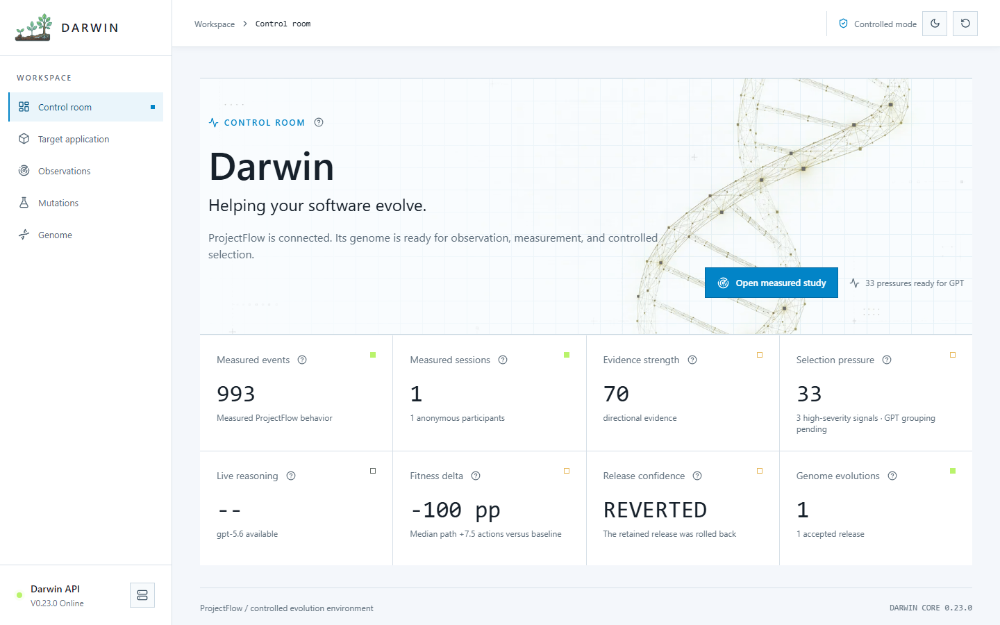
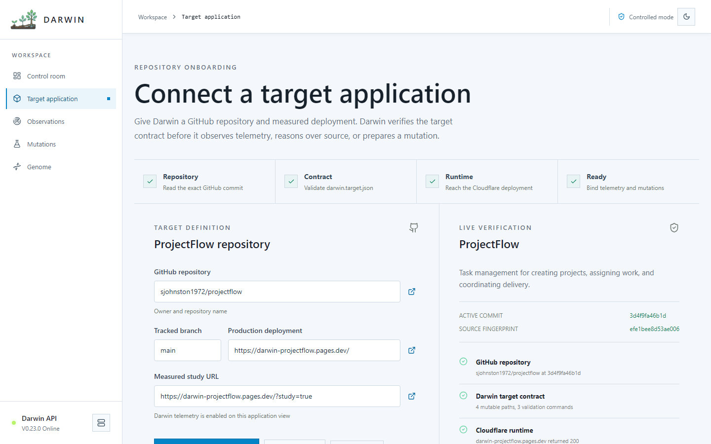
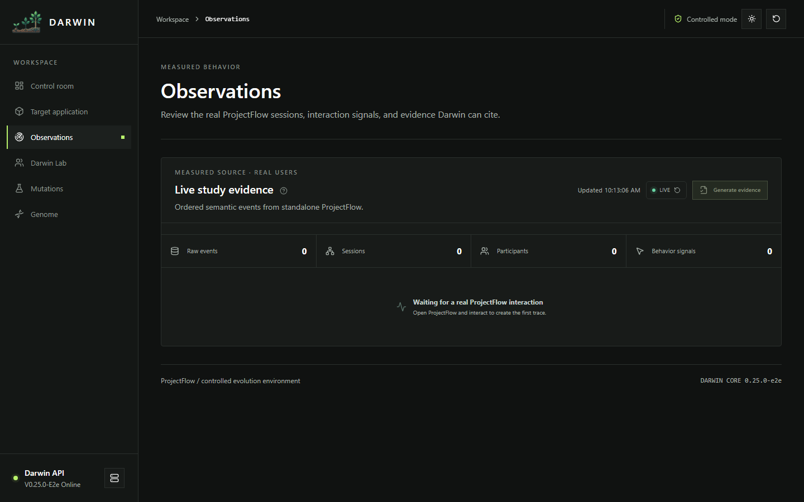
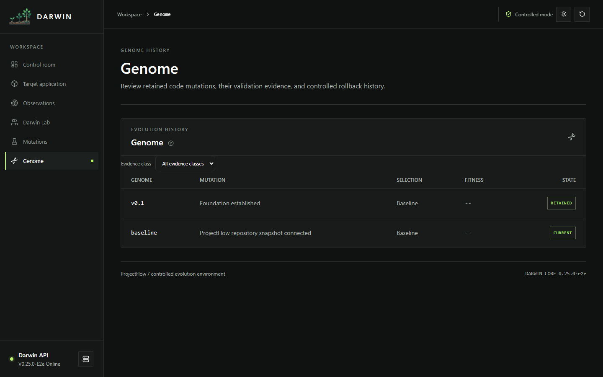

# Darwin

<p align="center">
  
</p>

<h3 align="center">Helping your software evolve.</h3>

<p align="center">
  Darwin turns privacy-conscious product telemetry into a human-approved,
  repository-backed software mutation with real validation, release, and rollback evidence.
</p>

<p align="center">
  <a href="https://darwin-control-room.pages.dev"><strong>Open Darwin</strong></a>
  &nbsp;|&nbsp;
  <a href="https://darwin-projectflow.pages.dev/?study=true"><strong>Open measured ProjectFlow study</strong></a>
  &nbsp;|&nbsp;
  <a href="https://github.com/sjohnston1972/darwin/wiki"><strong>Read the wiki</strong></a>
</p>

<p align="center">
  
  
  
  
</p>

## What Darwin proves

Darwin demonstrates one complete, inspectable evolution cycle:

1. Connect an instrumented target application and verify its exact GitHub commit.
2. Capture ordered semantic telemetry from real browser interaction.
3. Reconstruct journeys and derive deterministic, citable friction evidence.
4. Ask GPT-5.6 for a schema-valid portfolio of evidence-backed mutations.
5. Let a human select one or more mutations and create an immutable manifest.
6. Dispatch a bounded Codex workflow in the target repository.
7. Review the real patch, checks, pull request, and isolated deployment preview.
8. Release or reject the mutation; after merge, verify the exact production commit before opening the next evidence cycle.
9. Measure a compatible post-release cohort and retain the versioned 0-100 fitness outcome with the mutation in Genome.
10. Prepare a separate rollback when a retained mutation should be reverted; a released rollback stops the comparison.

The repository does **not** contain a prebuilt evolved ProjectFlow variant. A candidate exists only after a live manifest has been executed against the verified target commit.

## Product tour

### Control room

The operator view summarizes measured behavior, evidence strength, selection pressure, reasoning state, release confidence, and accepted Genome evolutions.

[](https://darwin-control-room.pages.dev)

### Target application

Darwin verifies the repository, `darwin.target.json` contract, deployment, telemetry surface, mutable paths, protected paths, and validation commands before reasoning or execution.

[](https://darwin-control-room.pages.dev/?view=target)

### Observations

The evidence inspector shows persisted events, sessions, anonymous participants, behavioral signals, deterministic evidence IDs, and the verified production commit, app version, and deployment time that bound each measurement cycle.

[](https://darwin-control-room.pages.dev/?view=observations)

### Genome

Genome preserves the repository mutation, evidence provenance, validation output, release state, pull request, preview, Codex report, measured fitness outcome, and rollback history.

[](https://darwin-control-room.pages.dev/?view=genome)

## Architecture

Darwin and ProjectFlow are separate repositories and deployments. Darwin owns observation, reasoning, and orchestration; ProjectFlow owns its source, mutation policy, validation, and deployment.

```mermaid
flowchart LR
  U[Measured ProjectFlow session] --> TC[Telemetry client]
  TC --> API[Cloudflare Worker API]
  API --> D1[(Cloudflare D1)]
  D1 --> EE[Deterministic evidence engine]
  EE --> GPT[GPT-5.6 structured reasoning]
  GPT --> MF[Human-selected manifest]
  MF --> GH[ProjectFlow GitHub Actions]
  GH --> CX[Codex mutation]
  CX --> VA[Repository validation]
  VA --> PR[Pull request and preview]
  PR -->|human release| GM[Genome]
  GM --> RB[Reviewable rollback]
```



Every analysis stores the ProjectFlow base SHA and a SHA-256 fingerprint of the exact source context. Every manifest is bound to that analysis, evidence hash, repository commit, allowed paths, protected paths, and validation commands.

Read the canonical [technical architecture](docs/ARCHITECTURE.md), the [Architecture wiki companion](docs/wiki/Architecture.md), and the [controlled evolution workflow](docs/wiki/AI-and-Mutation-Workflow.md).

## Evidence boundary

The browser records stable semantic IDs and bounded interaction measurements. It does not capture typed values, search terms, keystrokes, arbitrary page text, absolute screen coordinates, DOM paths, or raw cursor trails.

Captured behavior includes:

- session and page lifecycle;
- route changes and browser Back/Forward use;
- clicks, pointer type, normalized target position, and repeated-click signals;
- hover duration, hover without click, and hover-to-click latency;
- pointer transitions, bounded direction-change counts, and target indecision;
- drag intent on non-draggable surfaces and touch cancellation;
- relative browser zoom changes;
- validation error codes and search result counts without entered values;
- task-attempt start, completion, failure, and abandonment.

TypeScript reconstructs attempts, journeys, and detector signals before GPT is invoked. GPT receives privacy-safe ordered journeys, evidence summaries, the target application map, mutation examples, and the exact allowed ProjectFlow source snapshot.

The seeded scale replay remains separate:

```powershell
npm run simulate -- --seed=1859 --variant=baseline
```

It produces exactly 10,000 deterministic **synthetic** events. Synthetic events are rejected by the live evidence ingestion path and are never presented as real users.

Measured fitness is calculated only by the Worker after a released mutation has a distinct, compatible evolved evidence pack. Formula `1.0.0` weights task completion (30%), navigation efficiency (25%), error rate (15%), feature discovery (15%), and median duration (15%). Each cohort must cover all three fixed tasks with at least three terminal attempts, sessions, and anonymous participants. Darwin persists both evidence hashes, cohort identity, component scores, limitations, and the aggregate 0-100 scores; it emits no score when a gate fails and invalidates the comparison after a released rollback.

## Repository layout

```text
apps/web                    Darwin React + Vite control room
workers/api                 Cloudflare Worker API, evidence, GPT, GitHub orchestration
packages/shared             Zod contracts and shared TypeScript types
packages/telemetry-client   First-party semantic telemetry client
prompts                     Versioned reasoning and implementation prompts
docs                        Product, architecture, runbook, screenshots, wiki source
scripts                     Context generation, bootstrap, and production smoke checks
```

ProjectFlow lives at [`sjohnston1972/projectflow`](https://github.com/sjohnston1972/projectflow). It publishes `darwin.target.json` and owns `darwin-evolve.yml`, `darwin-rollback.yml`, and `darwin-reset.yml`.

## Local development

### Prerequisites

- Node.js 22 or newer
- npm 10 or newer
- a Cloudflare account for remote D1/Workers deployment
- an OpenAI API key for live reasoning
- a fine-grained GitHub token for the controlled ProjectFlow workflow

### Install and run

```powershell
git clone https://github.com/sjohnston1972/darwin.git
git clone https://github.com/sjohnston1972/projectflow.git
cd darwin
npm install
npm run dev
```

Local endpoints:

| Service             | URL                                  |
| ------------------- | ------------------------------------ |
| Darwin control room | `http://localhost:5173`              |
| Darwin Worker API   | `http://localhost:8787`              |
| ProjectFlow         | run separately from `../projectflow` |

Create `.env` from `.env.example` and configure the live integrations:

```dotenv
OPENAI_API_KEY=your_openai_api_key
OPENAI_MODEL=gpt-5.6
OPENAI_TIMEOUT_MS=60000
DARWIN_AI_MODE=live
GITHUB_TOKEN=your_fine_grained_github_token
DARWIN_CALLBACK_TOKEN=a_long_random_shared_secret
DARWIN_OPERATOR_TOKEN=a_separate_high_entropy_operator_token
DARWIN_VIEWER_TOKEN=an_optional_read_only_viewer_token
PROJECTFLOW_INGESTION_SECRET=a_separate_target_gateway_secret
PROJECTFLOW_REPOSITORY=sjohnston1972/projectflow
PROJECTFLOW_BRANCH=main
PROJECTFLOW_PRODUCTION_URL=https://darwin-projectflow.pages.dev/
PROJECTFLOW_STUDY_URL=https://darwin-projectflow.pages.dev/?study=true
PROJECTFLOW_ALLOWED_APP_VERSIONS=baseline,1.0.0
PROJECTFLOW_DEPLOYMENT_TIMEOUT_MS=90000
PROJECTFLOW_DEPLOYMENT_POLL_MS=5000
PROJECTFLOW_RESET_MAX_ATTEMPTS=60
```

The GitHub token requires the ProjectFlow permissions needed to dispatch Actions, read source, manage pull requests, and merge an approved change. Install `DARWIN_CALLBACK_TOKEN` as the matching ProjectFlow Actions secret. Install `PROJECTFLOW_INGESTION_SECRET` in both the Darwin Worker and ProjectFlow Pages project. Access tokens are entered into Darwin's unlock view and retained only in browser session storage. The optional viewer token receives aggregate telemetry and connection status only; raw traces, evidence, repository artifacts, and mutation controls require the operator's evidence-inspector or stronger capabilities.

## Quality checks

```powershell
npm run lint
npm run format:check
npm run docs:check
npm run typecheck
npm run test
npm run test:e2e
npm run build
```

The deterministic reasoning context is regenerated during `npm run build` and verified during `npm run typecheck`. The generated Worker route reference comes from the checked route contract; use `npm run docs:generate` after route changes and `npm run docs:check` to verify it.

The Playwright suite starts Darwin's real local Worker with an isolated D1 database plus the standalone ProjectFlow application. Only the OpenAI and GitHub network boundaries use deterministic fixtures, and that fixture mode is rejected on non-localhost requests. Set `PROJECTFLOW_E2E_DIR` when ProjectFlow is not available at `../projectflow`. Pull-request CI runs the `@smoke` browser path; the deployment workflow runs the complete suite.

Install the local browser runtime once with `npx playwright install chromium` before the first browser-suite run.

## Deployment

Configure the Worker and Pages secrets below. Production releases are deployed by manually dispatching **Deploy Darwin** from a semantic tag such as `v0.1.0`; the workflow rejects branch dispatches, injects that release plus the tagged 40-character commit into both builds, and runs the smoke test against the same metadata.

```powershell
npx wrangler secret put OPENAI_API_KEY --config workers/api/wrangler.toml
npx wrangler secret put GITHUB_TOKEN --config workers/api/wrangler.toml
npx wrangler secret put DARWIN_CALLBACK_TOKEN --config workers/api/wrangler.toml
npx wrangler secret put DARWIN_OPERATOR_TOKEN --config workers/api/wrangler.toml
npx wrangler secret put PROJECTFLOW_INGESTION_SECRET --config workers/api/wrangler.toml
npx wrangler pages secret put PROJECTFLOW_INGESTION_SECRET --project-name darwin-projectflow
```

For an equivalent operator-run deployment, export `DARWIN_RELEASE` and the exact `DARWIN_COMMIT_SHA`, then run `npm run deploy` followed by `npm run smoke:production`. The smoke test fails closed unless the deployed Worker reports both expected values.

ProjectFlow deploys independently from its own `main` branch. Candidate branches receive isolated Cloudflare preview deployments. Darwin never switches production to a candidate before an explicit release action, and it does not admit post-release telemetry into a new evidence cycle until production reports the merged commit and matching app version.

See [Operations and Deployment](docs/wiki/Operations-and-Deployment.md) for D1 migrations, secrets, rollback, smoke checks, and failure recovery.

## Three-minute demo

1. Run **Reset evolution demo** and wait for Darwin to verify the restored ProjectFlow deployment, then re-verify the target.
2. Open the measured study in a new window and interact with ProjectFlow.
3. Return to **Observations**, inspect the event trace, and generate evidence.
4. Open **Mutations**, invoke GPT-5.6, and expand the ranked pressure portfolio.
5. Select one or more supported mutations and start controlled evolution.
6. Follow the linked GitHub Actions run; review the real patch, checks, PR, and preview.
7. Release the reviewed mutation, verify the production deployment, and open its expanded Genome record.
8. Demonstrate the separate reviewable rollback path when appropriate.

The full script, failure branches, and reset checklist are in the [Demo Runbook](docs/wiki/Demo-Runbook.md).

## Security status

This is a public Build Week proof of life, locked to one configured ProjectFlow target. The control plane requires capability-scoped operator authorization, protected responses are non-cacheable, ProjectFlow submits HMAC-signed telemetry through a narrow same-origin gateway, repository callbacks are execution-scoped and replay-protected, and the simulator is authenticated and resource-bounded. It is **not ready to connect to a production repository or private customer telemetry** while retention, CSP, and CI hardening remain open.

Start with [Security and Privacy](docs/wiki/Security-and-Privacy.md) and the [open security issues](https://github.com/sjohnston1972/darwin/issues?q=is%3Aissue+is%3Aopen+label%3Asecurity).

## Documentation

- [Current product specification](docs/PRODUCT_SPEC.md)
- [Canonical technical architecture](docs/ARCHITECTURE.md)
- [Real telemetry and evidence plan](docs/REAL_TELEMETRY_PLAN.md)
- [Three-minute demo source](docs/DEMO_SCRIPT.md)
- [Generated Worker API routes](docs/generated/API_ROUTES.md)
- [Documentation ownership and freshness](docs/DOCUMENTATION.md)
- [GitHub wiki](https://github.com/sjohnston1972/darwin/wiki)
- [Wiki source in this repository](docs/wiki/Home.md)
- [Architecture](docs/wiki/Architecture.md)
- [Telemetry and Evidence](docs/wiki/Telemetry-and-Evidence.md)
- [Data retention and deletion](docs/RETENTION.md)
- [AI and Mutation Workflow](docs/wiki/AI-and-Mutation-Workflow.md)
- [API Reference](docs/wiki/API-Reference.md)
- [Operations and Deployment](docs/wiki/Operations-and-Deployment.md)
- [Troubleshooting](docs/wiki/Troubleshooting.md)

## License

[MIT](LICENSE)
