# Darwin Technical Architecture

**Status:** Canonical system architecture for the controlled ProjectFlow repository workflow.

```mermaid
flowchart LR
  PF[ProjectFlow measured deployment] --> TC[Telemetry client]
  LAB[Darwin Lab browser population] -->|real target actions| PF
  TC --> API[Cloudflare Worker]
  UI[Darwin control room] --> API
  API <--> D1[(D1 evidence and execution state)]
  D1 --> EE[Deterministic evidence engine]
  EE --> GPT[GPT-5.6 evidence-citing reasoning]
  GPT --> MF[Human-selected immutable manifest]
  MF --> GH[ProjectFlow GitHub Actions]
  GH --> CX[Bounded Codex patch]
  CX --> PR[Policy checks, pull request, preview]
  PR -->|human release| GM[Genome]
  GM -->|human-approved revert| RB[Rollback pull request]
  RB --> GM
```



## Ownership boundaries

Darwin owns target verification, observation, deterministic evidence, live reasoning, manifest construction, GitHub workflow dispatch, execution state, and Genome presentation. ProjectFlow owns its application source, `darwin.target.json`, instrumentation integration, mutation and rollback workflows, path/budget enforcement, validation commands, pull requests, previews, and deployment.

ProjectFlow publishes `darwin.target.json` at every commit. Darwin resolves the
configured branch to a 40-character SHA, reads that policy and application map
plus approved context files from the same SHA, hashes the context and stores the
SHA and source hash with evidence and analysis. Evidence generation accepts one
commit-derived application version matching that connected snapshot.

The target is never bundled into the control-room build. Darwin has no prebuilt evolved ProjectFlow version and cannot switch production to a local variant.

## Target snapshot

Target application onboarding resolves the configured ProjectFlow branch to a 40-character SHA. Darwin reads `darwin.target.json` and approved source files from that exact commit, validates policy, canonicalizes source context, and stores its hash. Evidence analysis and the Codex manifest retain both the base SHA and source hash. A changed target commit requires a new snapshot and analysis.

## Primary data flow

```text
browser action
  -> signed, schema-valid semantic event
  -> measured D1 record
  -> deterministic attempt and detector output
  -> canonical evidence pack and SHA-256 hash
  -> evidence-citing GPT portfolio
  -> human-selected implementation manifest
  -> signed ProjectFlow workflow callback
  -> actual diff, checks, pull request, and preview
  -> explicit release or rejection
  -> retained or reverted Genome record
```

Synthetic scale replay uses a separate API and evidence class. It never enters measured cohorts or measured fitness.

Darwin Lab is a distinct automated-observation path. A versioned task definition
is hashed before execution; isolated Playwright contexts act on the verified
ProjectFlow deployment, and signed semantic events are stored with the
experiment, task hash, run, session, attempt, app version, and `darwin_lab`
provenance. Deterministic `L-EV-*` evidence can enter the same human-approved
manifest and repository workflow, but it never contributes to human participant
counts or measured human fitness. Provenance is included in evidence and
manifest hashes and persists through the pull request, Genome, and rollback.

## Trust boundaries

The browser can request analysis, select a candidate bundle, and request controlled actions, but it never receives GitHub, OpenAI, ingestion, or callback credentials. Operator routes require capability-scoped bearer authorization. ProjectFlow ingestion/workspace routes require target HMAC authentication. Repository workflow callbacks use execution-scoped signed credentials with replay protection.

Codex runs in a read-only-content job. A separate write job owned by ProjectFlow rejects protected paths, out-of-policy files, oversized diffs, stale SHAs, or invalid manifests before applying a patch. Validation runs before a pull request or preview is accepted. Only an explicit release request merges a reviewed pull request.

## Persistence

D1 stores measured telemetry, anonymous participant workspaces, evidence packs,
GPT analyses, manifests, target connections, repository executions,
evolution-cycle state, retained provenance, Lab task/experiment state,
append-only Lab runs/actions, and Lab evidence/analysis/selection artifacts.
In-memory implementations support local development and unit tests.

Mutation execution states:

```text
prepared -> queued -> codex_running -> validating
         -> pull_request_open -> preview_ready -> releasing
         -> deployment_verifying -> released
         -> failed
```

Rollback execution states:

```text
prepared -> queued -> validating -> pull_request_open
         -> preview_ready -> releasing -> released
         -> failed
```

## API surface

The checked route contract is `workers/api/src/api-route-contract.ts`. It drives route authorization lookup and generates [the complete Worker API reference](generated/API_ROUTES.md). Run `npm run docs:generate` after any route change; `npm run docs:check` fails when generated documentation is stale.

Request and response bodies are validated with the Zod contracts in `packages/shared/src/contracts.ts`.

## Failure behavior

- Missing or failed GPT access produces no recommendation.
- A changed target SHA invalidates the previous analysis/manifest path.
- Invalid ingestion and callback signatures are rejected before persistence changes.
- Failed Codex, validation, preview, release, or rollback states remain visible with real provider output.
- A pull request is never merged without explicit release authority.
- Missing measured post-release evidence never becomes an invented fitness improvement.
- A merged mutation is not recorded as released until ProjectFlow production reports the merged commit and app version.
- Evidence generation rejects telemetry that crosses application-version boundaries.
- Reset preserves existing state until an authenticated ProjectFlow workflow callback reaches deployment and production reports the restored baseline commit.

## Related source documents

- [Current product specification](PRODUCT_SPEC.md)
- [Real telemetry and evidence plan](REAL_TELEMETRY_PLAN.md)
- [Three-minute demo](DEMO_SCRIPT.md)
- [Documentation ownership and freshness](DOCUMENTATION.md)
