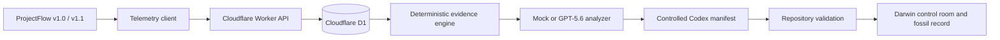

# Darwin Technical Architecture



## System overview

```text
Darwin Web App (`apps/web`)
├── Darwin Control Room
├── Standalone ProjectFlow target application launcher
├── Observation Visualisation
├── Mutation Viewer
├── Diff + Validation Viewer
└── Fossil Record
        │
        ▼
Cloudflare Worker API
├── Real telemetry ingestion and ordered traces
├── Deterministic evidence generation
├── Explicitly labelled simulation service
├── Fitness calculator
├── Evolution analyzer interface
│   ├── deterministic mock
│   └── OpenAI GPT-5.6 adapter
├── Mutation workflow
└── Timeline persistence
        │
        ▼
Cloudflare D1 or local in-memory adapter

Standalone ProjectFlow (`apps/projectflow`)
├── Functional projects, tasks and reports
├── Anonymous study runner
└── `packages/telemetry-client` instrumentation
```

## Workspace layout

```text
apps/web
apps/projectflow
workers/api
packages/shared
packages/telemetry-client
prompts
docs
scripts
```

## Shared contracts
Create Zod schemas for:
- `TelemetryEvent`
- `Persona`
- `SimulationRun`
- `FrictionFinding`
- `MutationProposal`
- `ValidationResult`
- `FitnessBreakdown`
- `EvolutionRecord`

## API routes

```text
GET  /api/health
POST /api/demo/reset
POST /api/telemetry/events
GET  /api/studies/:id/events
GET  /api/studies/:id/sessions/:sessionId
GET  /api/studies/:id/participants/:participantId/workspace
PUT  /api/studies/:id/participants/:participantId/workspace
POST /api/studies/:id/evidence
POST /api/studies/:id/analyse-evidence
GET  /api/studies/:id/evidence-analysis/latest
POST /api/evidence-analyses/:id/codex-manifest
GET  /api/outcomes/automated-comparison
POST /api/outcomes/automated-comparison
POST /api/simulations
GET  /api/simulations/:id
GET  /api/simulations/:id/summary
POST /api/evolution/analyse
POST /api/mutations/:id/approve
POST /api/mutations/:id/reject
POST /api/mutations/:id/validate
POST /api/mutations/:id/release
GET  /api/evolution/timeline
GET  /api/organism/state
POST /api/organism/state
```

## Deterministic simulation
Use a seeded PRNG. Simulate sessions from four personas and predefined goals. Generate event sequences probabilistically but deterministically.

Simulation is a separate `synthetic` evidence source used for scale replay. It
does not contribute to real participant counts or measured study fitness. The
primary evidence path is defined in `docs/REAL_TELEMETRY_PLAN.md`.

The baseline route graph should induce:
- developer users entering Projects before Tasks
- repeated backtracking
- high search use once Tasks is reached
- low Reports usage
- dashboard widget neglect
- avoidable task creation clicks

The evolved route graph should produce more direct paths and lower duration/error values.

## Deterministic evidence engine

Real events are grouped by explicit `taskAttemptId`, ordered by session sequence
and terminated only by success, failure, session end or the documented timeout.
Parser `1.1.0` runs versioned workflow rules for navigation loops, repeated
targets, abandonment, excess path length, validation friction and search
dependency. It also converts bounded pointer observations into rage-click,
false-affordance, hover-hesitation, cursor-indecision, drag-expectation and
touch-conflict evidence.

Every signal stores its rule version, affected attempt IDs, supporting event IDs
and a bounded trace. Canonical JSON excludes generation time from its digest, so
identical source records and parser code produce the same SHA-256 evidence hash.
Evidence packs are stored in `analysis_runs` and remain independent of GPT-5.6.

## Outcome validation

Baseline `v1.0.0` and evolved `v1.1.0` use separate automated study IDs. The
critical Playwright flow performs the same `find-assigned-task` task against both
variants with telemetry source `automated`, then generates independent evidence
packs. The Worker refuses mixed or measured sources and compares completion,
median interactions and median duration for matching task identities.

Fresh comparisons are stored as `live_automated_run`. A checked-in result from an
actual repository Playwright run is available as `recorded_automated_run` when a
hosted Worker has no fresh cohorts. Both labels remain distinct from measured
human evidence and simulated scale replay.

## Fitness calculation
Normalise each metric to 0–100, then calculate:

```text
fitness =
  completion_rate * 0.35 +
  navigation_efficiency * 0.25 +
  inverse_error_rate * 0.15 +
  feature_discovery * 0.15 +
  inverse_task_duration * 0.10
```

Document baseline constants and thresholds. Avoid arbitrary unexplained numbers.

Implemented normalisation:

- `completion_rate`: observed completed workflows divided by completed plus abandoned workflows.
- `navigation_efficiency`: starts at the ideal one-page direct path and applies a diminishing reciprocal penalty of `0.35` for each additional page view plus `1.2` for each backtrack. A reversal is intentionally weighted more heavily than a forward navigation step.
- `inverse_error_rate`: percentage of workflow sessions without a validation error.
- `feature_discovery`: completion rate for discovery-sensitive goals: finding assigned tasks, creating a task and reviewing reports.
- `inverse_task_duration`: reciprocal duration score using 90 seconds as the reference point; a 90-second median scores 50, faster workflows approach 100 and slower workflows decline smoothly.

All component scores are clamped to 0–100 and rounded to one decimal place before being exposed. The weighted total uses the product-specified 35/25/15/15/10 proportions.

## AI boundary
The browser never calls OpenAI directly.

`EvolutionAnalyzer`:

```ts
interface EvolutionAnalyzer {
  analyse(input: EvolutionAnalysisInput): Promise<MutationProposal>;
}
```

The API chooses mock or OpenAI implementation based on environment variables.

- `DARWIN_AI_MODE=live` is the deployed configuration. With `OPENAI_API_KEY` it calls the OpenAI Responses API using `OPENAI_MODEL` and strict JSON-schema output.
- Missing credentials, timeouts, API failures or invalid structured output use the deterministic analyzer, which follows the same evidence-to-remediation policy.
- The scale-replay input contains aggregate telemetry, ranked findings, fitness, the mutation allow-list and a structured ProjectFlow product map covering purpose, users, entities, goals, navigation and capabilities; raw events and secrets are never included.
- The real-session evidence path sends its compact, hashed evidence pack with the same structured ProjectFlow context so the model can interpret routes and controls rather than reason from isolated counters.
- Both model paths prepend a generated, hash-versioned static corpus containing the approved telemetry-to-evolution examples and the real ProjectFlow application, data and style sources. Dynamic evidence is placed last.
- Requests use the context version as `prompt_cache_key` with 24-hour retention. Returned cached-token usage is recorded on evidence analysis when available, while `npm run context:check` prevents stale source snapshots.
- Live output is validated by the shared Zod schema and checked against the file allow-list before entering the approval workflow.
- Missing credentials, timeouts, API errors and invalid responses fall back to the deterministic mock analyzer and expose the fallback reason to the UI.
- Logs contain model, response/request IDs, duration and outcome only. Prompt content, response content and credentials are not logged.

## Mutation implementation
For MVP reliability, implement two complementary paths:

1. **Recorded real mutation**
   - During development, Codex creates the evolved variant.
   - Store the actual Git diff in a fixture generated from the repository.
   - Display it during the demo.

2. **Live implementation brief**
   - GPT-5.6 proposal is converted into a Codex-ready task.
   - Expose copy/download functionality.

Optional stretch: invoke Codex CLI in a local-only orchestration script, never from Cloudflare production.

### Validation and release

- `npm run validate:record` is the local command runner. It executes the real workspace typecheck, Vitest suites and production build, captures their exit status, duration and output, and derives evolved fitness from the seeded simulator.
- The same recorder runs `git diff --no-index` against the typed baseline and evolved ProjectFlow genome sources. The resulting patch is an actual repository source comparison, not handwritten display text.
- The generated `phase7-artifacts.json` fixture is checked in for hosted mode. The Worker serves it as a clearly labelled recorded repository run and never exposes arbitrary command execution.
- Mutation state advances through `proposed → approved → validated → released`. Approval does not change the active target application; only a passing validation can be released.
- React renders diff text as escaped content and never injects artifact HTML.
- The in-memory timeline persists across browser reloads for the local/hosted fallback and is cleared by the deterministic demo reset. D1-backed persistence is introduced in Phase 9.

## Persistence
Use repository interfaces so D1 and in-memory implementations share behaviour.

Tables:
- studies
- study_participants
- study_task_attempts
- simulation_runs
- telemetry_events
- analysis_runs
- evidence_analyses
- codex_manifests
- outcome_validations
- mutation_proposals
- validation_results
- evolution_records
- organism_state

All real-study raw events are retained for traceability. Generated scale events
may be stored as aggregates, but their synthetic provenance is mandatory and the
UI displays real, automated and synthetic counts separately.

## Security
- OpenAI key only in Worker secrets.
- Validate every AI response with Zod.
- Reject proposals outside an allow-listed mutation scope.
- Do not expose arbitrary code execution in production.
- Escape code diff content before rendering.
