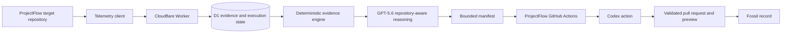

# Darwin Technical Architecture



## Ownership Boundaries

Darwin owns observation, evidence, reasoning and orchestration. ProjectFlow owns
its product source, repository policy, validation commands, mutation workflow
and deployment. The target is never bundled into the control-room build.

ProjectFlow publishes `darwin.target.json` at every commit. Darwin resolves the
configured branch to a 40-character SHA, reads that policy and application map
plus approved context files from the same SHA, hashes the context and stores the
SHA and source hash with evidence and analysis. Evidence generation accepts one
commit-derived application version matching that connected snapshot.

## Trust Boundary

The browser can request an analysis or select candidate mutations, but it never
receives GitHub or OpenAI credentials. The Worker creates and signs a manifest.
ProjectFlow Actions retrieves that manifest using the callback secret and
refuses execution when the repository, base SHA or manifest hash differs.

Codex runs in a read-only-content job. Its patch is passed to a separate write
job, where repository-owned code enforces mutable paths, protected paths,
maximum changed files and maximum changed lines. Validation runs before any pull
request or preview is created.

## Live API Surface

```text
GET  /api/health
POST /api/demo/reset
POST /api/telemetry/events
GET  /api/studies/:study/events
GET  /api/studies/:study/events/raw
GET  /api/studies/:study/sessions/:session
POST /api/studies/:study/evidence
GET  /api/studies/:study/evidence/latest
POST /api/evidence/:evidenceId/analyse
GET  /api/evidence-analyses/:analysisId
POST /api/evidence-analyses/:analysisId/codex-manifest
GET  /api/evidence-analyses/:analysisId/codex-manifest
POST /api/evidence-analyses/:analysisId/codex-manifest/execution
GET  /api/evidence-analyses/:analysisId/codex-manifest/execution
GET  /api/repository-executions/:executionId
POST /api/repository-executions/:executionId/release
GET  /api/repository-manifests/:manifestId
POST /api/repository-executions/:executionId/callback
POST /api/simulations
GET  /api/simulations/:id
GET  /api/simulations/:id/summary
```

There are intentionally no organism-variant, recorded-outcome or simulated
mutation endpoints.

## Persistence

D1 stores real telemetry, participant workspaces, evidence packs, GPT analyses,
manifests and repository executions. Reset deletes those records and dispatches
ProjectFlow's baseline restoration workflow. In-memory implementations cover
local development and unit tests.

## Failure Behavior

- Missing or failed GPT access returns an error and no recommendation.
- A changed target SHA requires a new analysis and manifest.
- Invalid callbacks are rejected before execution state changes.
- Failed Codex or validation jobs remain visible with their real output.
- A pull request is never merged without an explicit release request.
