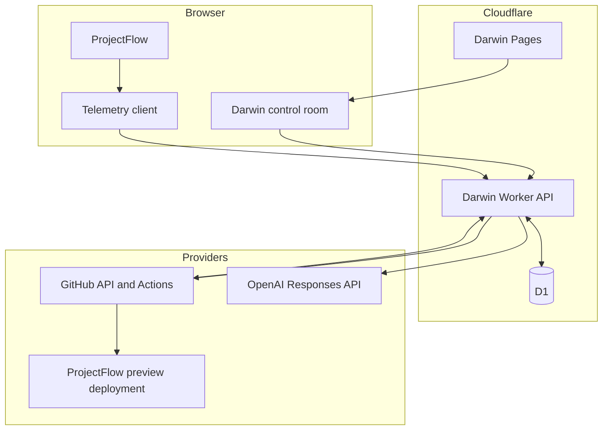

# Architecture

## System context



## Ownership boundaries

### Darwin repository

Darwin owns:

- the control room UI;
- telemetry contracts and ingestion;
- event persistence and aggregation;
- deterministic evidence parsing;
- GPT prompt/context assembly and output validation;
- manifest construction;
- GitHub workflow dispatch, execution state, release, and rollback records.

### ProjectFlow repository

ProjectFlow owns:

- target product source;
- `darwin.target.json`;
- semantic instrumentation integration;
- mutation and rollback workflows;
- protected/mutable path enforcement;
- validation commands and change budgets;
- preview and production deployment.

This division ensures the target repository enforces its own policy even when Darwin proposes the work.

## Target snapshot

When a target is verified, Darwin:

1. resolves the configured branch to a 40-character commit SHA;
2. reads `darwin.target.json` from that exact SHA;
3. validates mutable paths, protected paths, context paths, commands, and budgets;
4. reads only approved context files from the same SHA;
5. canonicalizes and hashes the source context;
6. verifies that the configured study deployment responds as ProjectFlow;
7. stores the connection and verification checks.

The GPT analysis and Codex manifest retain the base SHA and source hash. A changed target requires a new repository snapshot and analysis.

## Durable data

D1 tables currently store:

| Table                    | Purpose                                                |
| ------------------------ | ------------------------------------------------------ |
| `telemetry_events`       | ordered semantic events and receipt metadata           |
| `participant_workspaces` | anonymous ProjectFlow study workspace state            |
| `analysis_runs`          | deterministic evidence packs                           |
| `evidence_analyses`      | validated GPT portfolios and cache metadata            |
| `codex_manifests`        | immutable approved implementation manifests            |
| `repository_executions`  | workflow, diff, checks, PR, preview, release, rollback |
| `outcome_validations`    | reserved measured outcome records                      |
| `demo_state`             | evolution cycle state                                  |
| `target_connections`     | verified target snapshot and checks                    |

In-memory implementations support local tests and development without D1.

## State machines

Mutation execution:

```text
prepared -> queued -> codex_running -> validating
         -> pull_request_open -> preview_ready -> releasing
         -> deployment_verifying -> released
         -> failed (from any non-terminal stage)
```

Rollback execution:

```text
prepared -> queued -> validating -> pull_request_open
         -> preview_ready -> releasing -> released
         -> failed (from any non-terminal stage)
```

Only an explicit release call merges a reviewed pull request. Candidate previews never replace production automatically. After merge, Darwin polls the configured ProjectFlow study deployment for semantic commit and app-version metadata. The execution remains deployment-ready until both match the merge result; only then does Darwin record `released` and start the next evidence cycle at the verified deployment timestamp. Evidence generation rejects mixed-version measurement windows.

## Generated reasoning context

`scripts/generate-reasoning-context.mjs` combines the versioned prompt material and mutation examples into `workers/api/src/reasoning/generated-context.ts`. `npm run typecheck` verifies that the generated file is current; `npm run build` regenerates it.

## Known architectural hardening

The public Build Week deployment now has capability-scoped operator authorization, HMAC-authenticated ProjectFlow ingestion, protected read APIs, execution-scoped signed repository callbacks with replay protection, atomic release transitions, and deployment-aware evidence cycles. It remains a controlled hackathon proof of life rather than a production trust boundary.

See [Security and Privacy](Security-and-Privacy.md) and the [issue backlog](https://github.com/sjohnston1972/darwin/issues).
